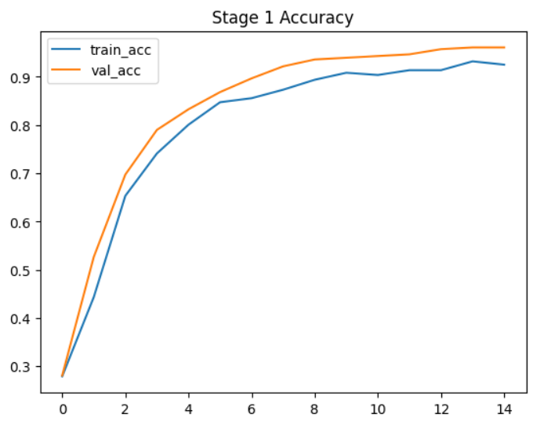
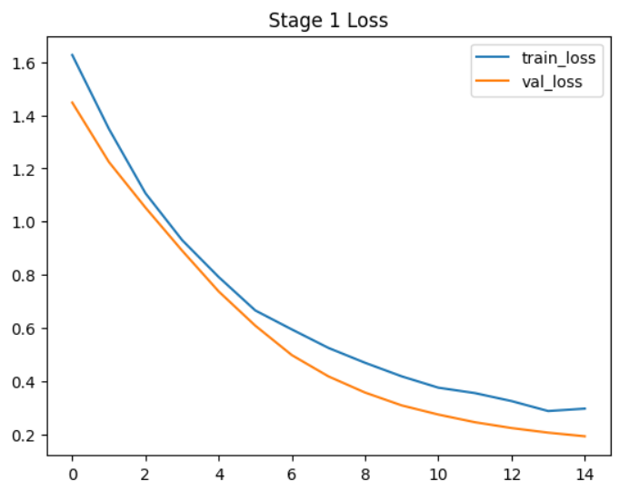
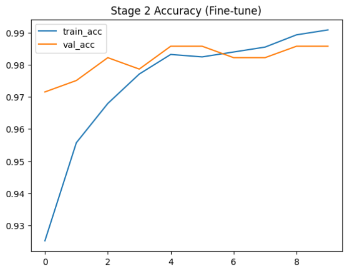
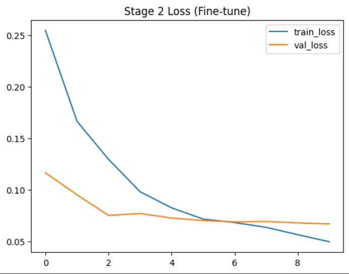
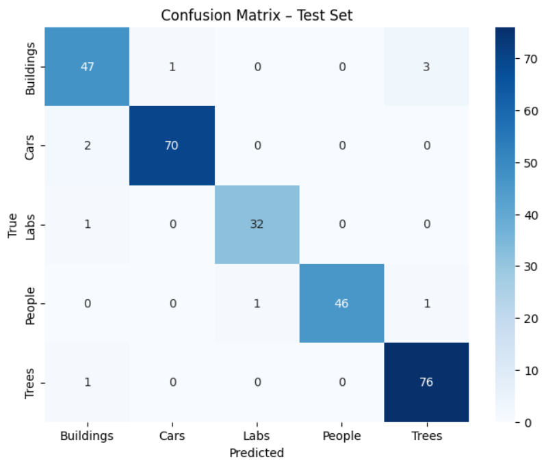
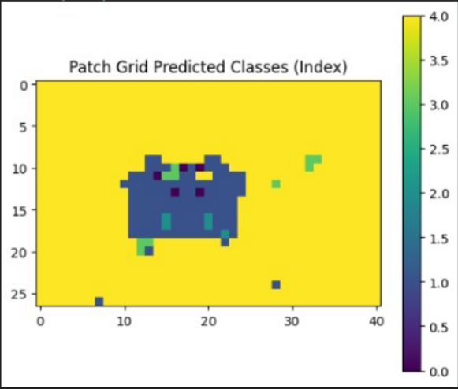

# Campus Scene Recognition with ResNet50

  

A deep learning framework for multi-class image classification of complex campus scenes. The architecture combines a pre-trained **ResNet50** backbone with a lightweight **Inception-style** classification head to capture multi-scale visual features, and uses **patch-based inference** to detect both primary and secondary classes within a single image.

## Features

- Two-stage transfer learning: frozen-backbone training followed by fine-tuning of the last 30 layers
- Custom Inception-style head (1×1, 3×3, 5×5 convolution branches) added on top of ResNet50 for richer feature capture
- Patch-based sliding-window inference for detecting both a dominant class and secondary classes in one image
- Trained and evaluated on a 1,872-image dataset across 5 classes (Buildings, Cars, Labs, People, Trees)
- Achieves 96% classification accuracy
- Full evaluation suite: accuracy, macro F1, top-2 accuracy, AUC (one-vs-rest), confusion matrices

## How It Works

1. **Backbone** — Load ResNet50 pre-trained on ImageNet, frozen initially.
2. **Custom head** — Attach an Inception-style block (parallel 1×1/3×3/5×5 convolutions, concatenated) followed by global pooling, dropout, and a softmax output layer.
3. **Stage 1 training** — Train only the new head with the backbone frozen.
4. **Stage 2 fine-tuning** — Unfreeze the last 30 layers of the backbone and continue training at a low learning rate.
5. **Patch-based inference** — At prediction time, slide a 224×224 window across the full image, classify each patch, and aggregate predictions to determine both the dominant class and any secondary classes present.

## Results

**Training Curves — Stage 1 (frozen backbone)**




**Training Curves — Stage 2 (fine-tuning)**




Fine-tuning the last 30 layers in Stage 2 pushed validation accuracy from ~93% to ~98.6%, with validation loss dropping below 0.1.

**Confusion Matrix (Test Set)**



**Patch-Based Inference Example**



*Example patch-based prediction showing dominant and secondary class detection.*

## Repository Structure

```
image-classification-resnet50/
├─ README.md
├─ requirements.txt
├─ Paper/
│  └─ Image_Classification_ResNet50.pdf
├─ dataset/
│  └─ README.md
├─ results/
│  └─ (visualizations, confusion matrix, training curves)
└─ python/
   ├─ train.py
   ├─ inference.py
   ├─ utils.py
   └─ models/
      └─ resnet50_inception.py
```

## Dataset

The dataset (~2GB) is not included in this repository due to GitHub size limits.

Download it here: [Google Drive link](https://drive.google.com/drive/folders/1q2xBKP1ExttsHQT2joEfJPty0vXDNGjX?usp=sharing)

After downloading, extract it so the structure looks like:
```
dataset/
├─ Buildings/
├─ Cars/
├─ Labs/
├─ People/
└─ Trees/
```

## Requirements

- tensorflow==2.13.0
- keras==2.13.1
- numpy==1.25.0
- pandas==2.1.0
- matplotlib==3.8.0
- seaborn==0.12.3
- scikit-learn==1.3.0

## How to Run

1. Clone the repository:
   ```bash
   git clone https://github.com/JanaM-10/image-classification-resnet50.git
   cd image-classification-resnet50
   ```
2. Install dependencies:
   ```bash
   pip install -r requirements.txt
   ```
3. Download and place the dataset as described above.
4. Train the model:
   ```bash
   python python/train.py
   ```
   This runs both training stages and saves the best model to `results/models/`.
5. Run patch-based inference on a new image:
   ```bash
   python python/inference.py
   ```
   Returns the dominant class and any secondary classes detected.

> **Note:** Trained model weights are not included in this repository due to file size. Run `train.py` to reproduce them, or request the saved weights directly.

## Future Improvements

- Add automated dataset download (script instead of manual Drive link)
- Package the patch-based visualization as a standalone utility script
- Experiment with additional backbones (EfficientNet, ConvNeXt) for comparison
- Add a lightweight inference API/demo for non-technical viewers

## Team

This project was developed as a group project in the Artificial Intelligence Department, University of Jordan, under the supervision of Instructor Tamam AlSarhan.

- Hiba Hamed
- Noor Yacoub
- Saja Obaidat
- Jana Abubaje

Full methodology, experiments, and results are documented in [`Paper/Image_Classification_ResNet50.pdf`](Paper/Image_Classification_ResNet50.pdf).
